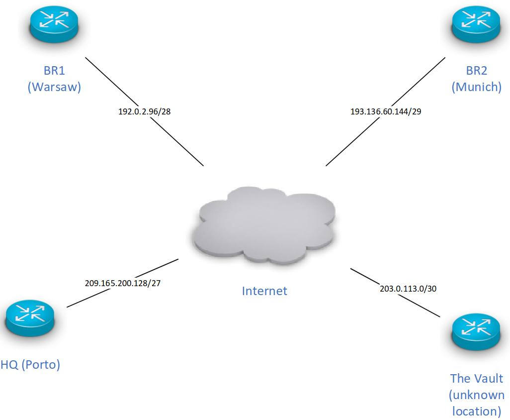
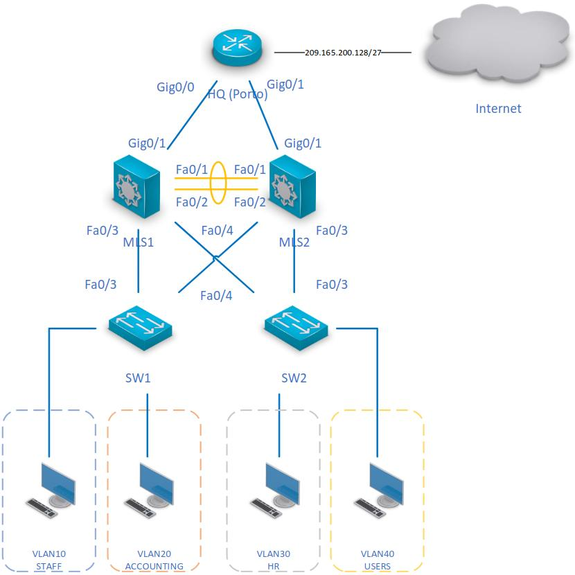
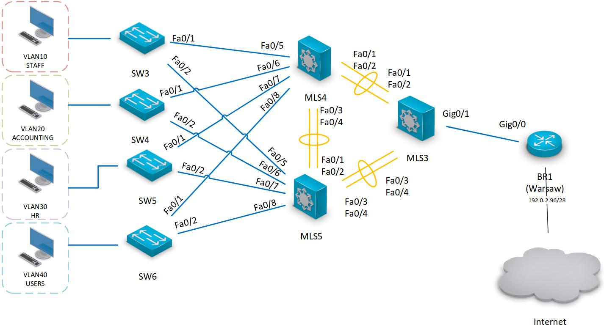
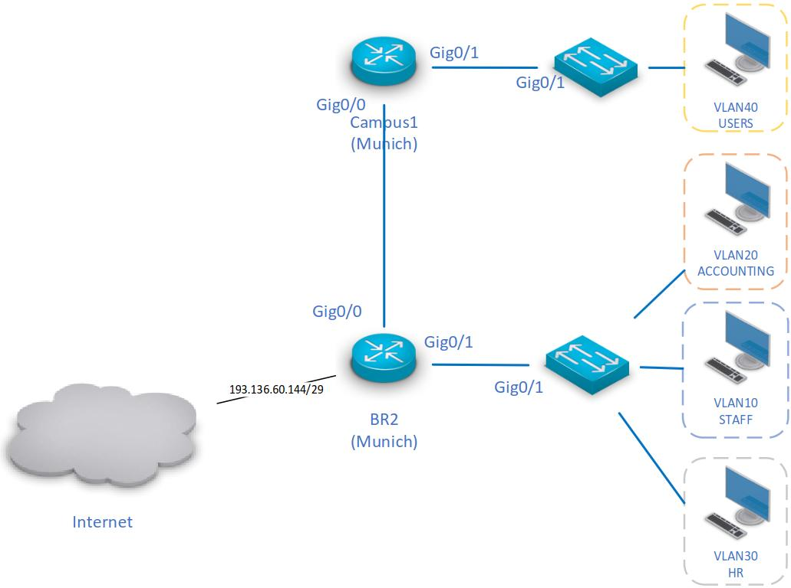
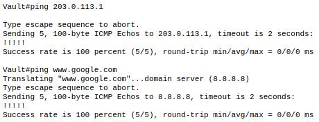

# Sprint 1

## M1B - Team 3

| Name                  | Student Number | Role / Site Responsibility |
| --------------------- | -------------- | -------------------------- |
|                       |                | *Oporto (HQ)*              |
|                       |                | *Warsaw (BR1)*             |
|                       |                | *Munich (BR2)*             |
| *Francisco Magalhães* | *1170589*      | *The Vault*                |

## General Configuration

- All unused switch ports are assigned to VLAN 99 and administratively shutdown;

---

## 1. Oporto (HQ)

### <u>**Assigned address space:**</u> 10.42.56.0/22

### 1.1 Network Addressing Table

| Network             | Hosts req. | CIDR | Mask            | Network Address | Broadcast Address | First Host   | Last Host    |
| ------------------- | ---------- | ---- | --------------- | --------------- | ----------------- | ------------ | ------------ |
| VLAN40 – USERS      | 500        | /23  | 255.255.254.0   | 10.42.56.0      | 10.42.57.255      | 10.42.56.1   | 10.42.57.254 |
| VLAN20 – ACCOUNTING | 200        | /24  | 255.255.255.0   | 10.42.58.0      | 10.42.58.255      | 10.42.58.1   | 10.42.58.254 |
| VLAN30 – HR         | 100        | /25  | 255.255.255.128 | 10.42.59.0      | 10.42.59.127      | 10.42.59.1   | 10.42.59.126 |
| VLAN10 – STAFF      | 50         | /26  | 255.255.255.192 | 10.42.59.128    | 10.42.59.191      | 10.42.59.129 | 10.42.59.190 |
| HQ ↔ MLS1           | 2          | /30  | 255.255.255.252 | 10.42.59.192    | 10.42.59.195      | 10.42.59.193 | 10.42.59.194 |
| HQ ↔ MLS2           | 2          | /30  | 255.255.255.252 | 10.42.59.196    | 10.42.59.199      | 10.42.59.197 | 10.42.59.198 |

### 1.2 Interface Addressing Table

#### 1.2.1 HQ (Oporto)

| Interface | Assigned IP   | Subnet Mask | Purpose                  |
| --------- | ------------- | ----------- | ------------------------ |
| Gig0/0    | 10.42.59.193  | /30         | Link to MLS1             |
| Gig0/1    | 10.42.59.197  | /30         | Link to MLS2             |
| Gig0/0/0  | DHCP-assigned | /27         | Internet (SP) connection |

#### 1.2.2 MLS1

| Interface | Assigned IP  | Subnet Mask | Purpose             |
| --------- | ------------ | ----------- | ------------------- |
| Gig0/1    | 10.42.59.194 | /30         | Link to HQ (Oporto) |
| Fa0/1     | —            | —           |                     |
| Fa0/2     | —            | —           |                     |
| Fa0/3     | —            | —           |                     |
| Fa0/4     | —            | —           |                     |

#### 1.2.3 MLS2

| Interface | Assigned IP  | Subnet Mask | Purpose             |
| --------- | ------------ | ----------- | ------------------- |
| Gig0/1    | 10.42.59.198 | /30         | Link to HQ (Oporto) |
| Fa0/1     | —            | —           |                     |
| Fa0/2     | —            | —           |                     |
| Fa0/3     | —            | —           |                     |
| Fa0/4     | —            | —           |                     |

#### 1.2.4 SW1

| Interface | Purpose |
| --------- | ------- |
|           |         |
|           |         |
| Fa0/3     |         |
| Fa0/4     |         |

#### 1.2.5 SW2

| Interface | Purpose |
| --------- | ------- |
|           |         |
|           |         |
| Fa0/3     |         |
| Fa0/4     |         |

#### 1.2.6 Oporto-STAFF

| Interface | Assigned IP   | Subnet Mask | Purpose     |
| --------- | ------------- | ----------- | ----------- |
| Fa0       | DHCP-assigned | /26         | VLAN10 host |

#### 1.2.7 Oporto-ACCOUNTING

| Interface | Assigned IP   | Subnet Mask | Purpose     |
| --------- | ------------- | ----------- | ----------- |
| Fa0       | DHCP-assigned | /24         | VLAN20 host |

#### 1.2.8 Oporto-HR

| Interface | Assigned IP   | Subnet Mask | Purpose     |
| --------- | ------------- | ----------- | ----------- |
| Fa0       | DHCP-assigned | /25         | VLAN30 host |

#### 1.2.9 Oporto-USERS

| Interface | Assigned IP   | Subnet Mask | Purpose     |
| --------- | ------------- | ----------- | ----------- |
| Fa0       | DHCP-assigned | /23         | VLAN40 host |

### 1.3 Connectivity Tests

| Source        | Destination        | Test Type | Result  |
| ------------- | ------------------ | --------- | ------- |
| HQ Router     | SP gateway         | `ping`    | Success |
| HQ Router     | www.google.com     | `ping`    | Success |
| HQ PC (STAFF) | HQ PC (ACCOUNTING) | `ping`    | Success |
| HQ PC (STAFF) | HQ PC (HR)         | `ping`    | Success |
| HQ PC (STAFF) | HQ PC (USERS)      | `ping`    | Success |

---

## 2. Warsaw (BR1)

### <u>**Assigned address space:**</u>172.23.68.0/23

### 2.1 Network Addressing Table

| Network             | Hosts req. | CIDR | Mask            | Network Address | Broadcast Address | First Host   | Last Host     |
| ------------------- | ---------- | ---- | --------------- | --------------- | ----------------- | ------------ | ------------- |
| VLAN40 – USERS      | 200        | /24  | 255.255.255.0   | 172.23.68.0     | 172.23.68.255     | 172.23.68.1  | 172.23.68.254 |
| VLAN10 – STAFF      | 30         | /27  | 255.255.255.224 | 172.23.69.0     | 172.23.69.31      | 172.23.69.1  | 172.23.69.30  |
| VLAN20 – ACCOUNTING | 20         | /27  | 255.255.255.224 | 172.23.69.32    | 172.23.69.63      | 172.23.69.33 | 172.23.69.62  |
| VLAN30 – HR         | 10         | /28  | 255.255.255.240 | 172.23.69.64    | 172.23.69.79      | 172.23.69.65 | 172.23.69.78  |
| MLS3 ↔ BR1          | 2          | /30  | 255.255.255.252 | 172.23.69.80    | 172.23.69.83      | 172.23.69.81 | 172.23.69.82  |
| MLS3 ↔ MLS4         | 2          | /30  | 255.255.255.252 | 172.23.69.84    | 172.23.69.87      | 172.23.69.85 | 172.23.69.86  |
| MLS3 ↔ MLS5         | 2          | /30  | 255.255.255.252 | 172.23.69.88    | 172.23.69.91      | 172.23.69.89 | 172.23.69.90  |

### 2.2 Interface Addressing Table

#### 2.2.1 BR1 (Warsaw)

| Interface | Assigned IP   | Subnet Mask | Purpose                  |
| --------- | ------------- | ----------- | ------------------------ |
| Gig0/0    | 172.23.69.81  | /30         | Link to MLS3             |
| Gig0/0/0  | DHCP-assigned | /28         | Internet (SP) connection |

#### 2.2.2 MLS3

| Interface | Assigned IP  | Subnet Mask | Purpose              |
| --------- | ------------ | ----------- | -------------------- |
| Gig0/1    | 172.23.69.82 | /30         | Link to BR1 (Warsaw) |
| Fa0/1     |              |             |                      |
| Fa0/2     |              |             |                      |
| Fa0/3     |              |             |                      |
| Fa0/4     |              |             |                      |

#### 2.2.3 MLS4

| Interface | Assigned IP | Subnet Mask | Purpose |
| --------- | ----------- | ----------- | ------- |
| Fa0/1     |             |             |         |
| Fa0/2     |             |             |         |
| Fa0/3     | —           | —           |         |
| Fa0/4     | —           | —           |         |
| Fa0/5     | —           | —           |         |
| Fa0/6     | —           | —           |         |
| Fa0/7     | —           | —           |         |
| Fa0/8     | —           | —           |         |

#### 2.2.4 MLS5

| Interface | Assigned IP | Subnet Mask | Purpose |
| --------- | ----------- | ----------- | ------- |
| Fa0/1     | —           | —           |         |
| Fa0/2     | —           | —           |         |
| Fa0/3     |             |             |         |
| Fa0/4     |             |             |         |
| Fa0/5     | —           | —           |         |
| Fa0/6     | —           | —           |         |
| Fa0/7     | —           | —           |         |
| Fa0/8     | —           | —           |         |

#### 2.2.5 SW3

| Interface | Purpose |
| --------- | ------- |
| Fa0/1     |         |
| Fa0/2     |         |
|           |         |

#### 2.2.6 SW4

| Interface | Purpose |
| --------- | ------- |
| Fa0/1     |         |
| Fa0/2     |         |
|           |         |

#### 2.2.7 SW5

| Interface | Purpose |
| --------- | ------- |
| Fa0/1     |         |
| Fa0/2     |         |
|           |         |

#### 2.2.8 SW6

| Interface | Purpose |
| --------- | ------- |
| Fa0/1     |         |
| Fa0/2     |         |
|           |         |

#### 2.2.9 Warsaw-STAFF

| Interface | Assigned IP   | Subnet Mask | Purpose     |
| --------- | ------------- | ----------- | ----------- |
| Fa0       | DHCP-assigned | /27         | VLAN10 host |

#### 2.2.10 Warsaw-ACCOUNTING

| Interface | Assigned IP   | Subnet Mask | Purpose     |
| --------- | ------------- | ----------- | ----------- |
| Fa0       | DHCP-assigned | /27         | VLAN20 host |

#### 2.2.11 Warsaw-HR

| Interface | Assigned IP   | Subnet Mask | Purpose     |
| --------- | ------------- | ----------- | ----------- |
| Fa0       | DHCP-assigned | /28         | VLAN30 host |

#### 2.2.12 Warsaw-USERS

| Interface | Assigned IP   | Subnet Mask | Purpose     |
| --------- | ------------- | ----------- | ----------- |
| Fa0       | DHCP-assigned | /24         | VLAN40 host |

### 2.3 Connectivity Tests

| Source            | Destination            | Test Type | Result  |
| ----------------- | ---------------------- | --------- | ------- |
| BR1 Router        | SP gateway             | `ping`    | Success |
| BR1 Router        | www.google.com         | `ping`    | Success |
| Warsaw PC (STAFF) | Warsaw PC (ACCOUNTING) | `ping`    | Success |
| Warsaw PC (STAFF) | Warsaw PC (HR)         | `ping`    | Success |
| Warsaw PC (STAFF) | Warsaw PC (USERS)      | `ping`    | Success |

---

## 3. Munich (BR2)

### <u>**Assigned address space:**</u> 192.186.166.0/23

### 3.1 Network Addressing Table

| Network             | Hosts req. | CIDR | Mask            | Network Address | Broadcast Address | First Host     | Last Host       |
| ------------------- | ---------- | ---- | --------------- | --------------- | ----------------- | -------------- | --------------- |
| VLAN40 – USERS      | 200        | /24  | 255.255.255.0   | 192.186.166.0   | 192.186.166.255   | 192.186.166.1  | 192.186.166.254 |
| VLAN20 – ACCOUNTING | 20         | /27  | 255.255.255.224 | 192.186.167.0   | 192.186.167.31    | 192.186.167.1  | 192.186.167.30  |
| VLAN10 – STAFF      | 10         | /28  | 255.255.255.240 | 192.186.167.32  | 192.186.167.47    | 192.186.167.33 | 192.186.167.46  |
| VLAN30 – HR         | 10         | /28  | 255.255.255.240 | 192.186.167.48  | 192.186.167.63    | 192.186.167.49 | 192.186.167.62  |
| BR2 ↔ Campus1       | 2          | /30  | 255.255.255.252 | 192.186.167.64  | 192.186.167.67    | 192.186.167.65 | 192.186.167.66  |

### 3.2 Interface Addressing Table

#### 3.2.1 BR2 (Munich)

| Interface | Assigned IP    | Subnet Mask | Purpose                                     |
| --------- | -------------- | ----------- | ------------------------------------------- |
| Gig0/0    | 192.186.167.65 | /30         | Link to Campus1 (Munich)                    |
| Gig0/1.10 | 192.186.167.46 | /28         | STAFF gateway (last available address)      |
| Gig0/1.20 | 192.186.167.30 | /27         | ACCOUNTING gateway (last available address) |
| Gig0/1.30 | 192.186.167.62 | /28         | HR gateway (last available address)         |
| Gig0/0/0  | 193.136.60.147 | /29         | Internet (SP) connection — static           |

#### 3.2.2 Campus1 (Munich)

| Interface | Assigned IP    | Subnet Mask | Purpose              |
| --------- | -------------- | ----------- | -------------------- |
| Gig0/0    | 192.186.167.66 | /30         | Link to BR2 (Munich) |
| Gig0/1    | 192.186.166.1  | /24         | USERS gateway        |

#### 3.2.3 Switch (Change it to the name you gave it)

| Interface | Purpose |
| --------- | ------- |
| Gig0/1    |         |
|           |         |

#### 3.2.4 Switch (Change it to the name you gave it)

| Interface | Purpose |
| --------- | ------- |
| Gig0/1    |         |
|           |         |
|           |         |
|           |         |

#### 3.2.5 Munich-USERS

| Interface | Assigned IP   | Subnet Mask | Purpose     |
| --------- | ------------- | ----------- | ----------- |
| Fa0       | DHCP-assigned | /24         | VLAN40 host |

#### 3.2.6 Munich-ACCOUNTING

| Interface | Assigned IP   | Subnet Mask | Purpose     |
| --------- | ------------- | ----------- | ----------- |
| Fa0       | DHCP-assigned | /27         | VLAN20 host |

#### 3.2.7 Munich-STAFF

| Interface | Assigned IP   | Subnet Mask | Purpose     |
| --------- | ------------- | ----------- | ----------- |
| Fa0       | DHCP-assigned | /28         | VLAN10 host |

#### 3.2.8 Munich-HR

| Interface | Assigned IP   | Subnet Mask | Purpose     |
| --------- | ------------- | ----------- | ----------- |
| Fa0       | DHCP-assigned | /28         | VLAN30 host |

### 3.3 Connectivity Tests

| Source            | Destination                 | Test Type | Result  |
| ----------------- | --------------------------- | --------- | ------- |
| BR2 Router        | SP gateway (193.136.60.150) | `ping`    | Success |
| BR2 Router        | www.google.com              | `ping`    | Success |
| Munich PC (STAFF) | Munich PC (ACCOUNTING)      | `ping`    | Success |
| Munich PC (STAFF) | Munich PC (HR)              | `ping`    | Success |
| Munich PC (STAFF) | Munich PC (USERS)           | `ping`    | Success |

---

## 4. The Vault

### <u>**Assigned address space:**</u> 10.31.111.0/24

### 4.1 Configuration Decisions

#### 4.1.1 Vault router: Internet (SP) connection (Gig0/0/0)

- **Static addressing:** The Vault is the one site whose SP link is configured manually, not by DHCP. I used the values given in the problem statement: `203.0.113.2/30`, with `203.0.113.1` as the gateway.

- **Default route:** I configured `ip route 0.0.0.0 0.0.0.0 203.0.113.1`. The Vault has a single exit toward the Internet, so one default route is enough and no routing protocol is needed.

#### 4.1.2 Vault router: internal interface (Gig0/1)

- I left Gig0/1 **unaddressed and administratively shut down**. The brief says the Vault’s internal details “will be disclosed as required during the project,” so there is no network to serve yet.
- I did **not** assign any address from `10.31.111.0/24`. The block is reserved for later sprints.
- Keeping an unneeded interface shut down also stops it from being used as an unintended entry point.

#### 4.1.3 Vault switch: VLANs and ports

- **VLAN 99 (BLACKHOLE) created locally:** The Vault is a separate site and does not share a VTP domain with HQ, Warsaw or Munich, so VLAN 99 is not inherited and had to be created on this switch.
- **All unused ports are assigned to VLAN 99 and shut down:** This covers `Fa0/1–Fa0/24`, `Gig0/1` and `Gig0/2`. Since the Vault has no internal hosts yet, every port, including the router uplink, counts as unused.
- **VLAN 1 not used:** No port is left in the default VLAN 1, as instructed. `show vlan brief` shows no interfaces in VLAN 1.
- **No trunks configured:** The only link, Router Gig0/1 ↔ Switch Gig0/1, carries no tagged traffic, so no trunk exists.

### 4.2 Interface Addressing Table

#### 4.2.1 Vault (unknown location)

| Interface | Assigned IP    | Subnet Mask | Purpose                                           |
| --------- | -------------- | ----------- | ------------------------------------------------- |
| Gig0/0/0  | 203.0.113.2    | /30         | Internet (SP) connection — static                 |
| Gig0/1    | *(unassigned)* | —           | Link to Vault Switch (administratively shut down) |

#### 4.2.2 Vault Switch

| Interface | Purpose                                                                         |
| --------- | ------------------------------------------------------------------------------- |
| Gig0/1    | Link to Vault Router (unused - assigned to VLAN 99, administratively shut down) |

### 4.3 Connectivity Tests

| Source       | Destination              | Test Type | Result  |
| ------------ | ------------------------ | --------- | ------- |
| Vault Router | SP gateway (203.0.113.1) | `ping`    | Success |
| Vault Router | www.google.com           | `ping`    | Success |

